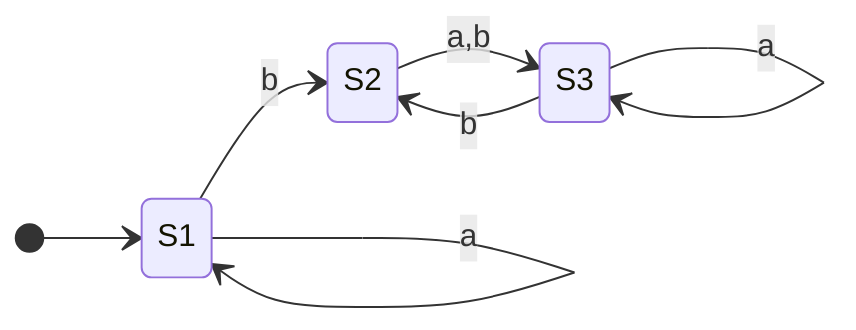

# [[Finite Automata (DFA and NFA)]]

**Context:** [[FIT2014_MOC]] · machines that **recognise** regular languages · the operational counterpart to [[Regular Expressions]] (equivalent by [[Kleene's Theorem]]) · **Assignment 1 material**

> [!abstract] Quick Revision
> - **🎯 Objective:** read a word **letter by letter**, moving between finitely many states ➔ **accept** if you finish in a Final state. The set of accepted strings is the **language recognised**.
> - **📦 Core Components:** **DFA** ➔ exactly **one** transition per (state, letter) | **NFA** ➔ **zero, one or many**, plus $\varepsilon$-moves.
> - **⚡ Critical Bottleneck:** a **DFA** gives every string a **unique** path (so complementing = swap Final/non-Final); an **NFA** accepts if **at least one** path reaches a Final state — so swapping states does **not** complement an NFA.

## 📝 Definition
A finite automaton consists of:
- **A finite set of states** ➔ one designated **Start State**, and some (possibly none) designated **Final States**.
- **An alphabet** $\Sigma$ of possible input letters.
- **A finite set of transitions** ➔ for each state and letter, which state to go to next.

- **Uses** ➔ deciding whether a word belongs to a regular language; **defining** a regular language; **lexical analysers**.
- **Notation** ➔ states are vertices (Start marked by an incoming arrow, Final drawn as a **double circle**, sometimes written $-$ and $+$); transitions are directed edges labelled by letters.

### Two representations
Both describe the same machine — the **transition table** is the exam-safe form.

| State | $\mathtt{a}$ | $\mathtt{b}$ |
| :--- | :--- | :--- |
| **Start** 1 | 1 | 2 |
| 2 | 3 | 3 |
| **Final** 3 | 3 | 2 |

## ⚙️ Execution and acceptance
- **Procedure** ➔ begin at the Start State; while input letters remain, read the next letter and move along the edge with that label; at the end, **accept** if in a Final State, otherwise **reject**.
- **Accepted / rejected** ➔ a string is **accepted** if its path ends on a Final State.
- **Language recognised** ➔ the **set of all strings the automaton accepts**; we say the FA *recognises* (or *accepts*) that language.

### Special cases worth being able to build
- All words accepted · no words accepted · only $\varepsilon$ accepted · only non-empty words accepted · exactly one word accepted.

## 🔀 The two variants
### DFA (deterministic — the plain "FA")
- **Totality** ➔ there is a **unique transition from every state for every letter** — nothing is missing, nothing is ambiguous.
- **Consequence** ➔ every string traces **exactly one** path, so $\mathrm{endState}(w)$ is a single well-defined state, with $\mathrm{endState}(\varepsilon)=$ Start State.
- **Cost** ➔ often needs a **sink state** (a dead trap absorbing all failures) to keep the table total.

### NFA (nondeterministic)
- **Relaxed transitions** ➔ for a given state and letter there may be **no transition**, **one**, or **more than one**; labels may also be $\varepsilon$ (**change state without reading a letter**).
- **Paths** ➔ for a given string the path **might not exist** and **might not be unique**; if no transition exists for the current letter, the machine **crashes**.
- **Acceptance rule** ➔ **accept if there is at least one path** from Start to a Final State; **reject only if there are no such paths**.
- **Why bother** ➔ NFAs are dramatically easier to design: recognising $\mathtt{aba}$ needs a sink state as a DFA, but as an NFA it is a plain 4-state chain.

## ⚖️ Core Decision Matrix
| Property | DFA | NFA |
| :--- | :--- | :--- |
| transitions per (state, letter) | exactly **one** | zero, one, or many |
| $\varepsilon$-transitions | ✗ | ✓ |
| path for a given string | **unique** | none / one / several |
| acceptance | unique path ends Final | **some** path ends Final |
| easy to **design** | ✗ (sink states) | ✓ |
| easy to **complement** | ✓ (swap Final/non-Final) | ✗ |
| expressive power | **identical** — both recognise exactly the regular languages ([[Kleene's Theorem]]) | |

> [!NOTE] **Crossover Invariant:** NFAs are never *more powerful*, only more convenient — the [[NFA to DFA (Subset Construction)|subset construction]] converts any NFA into a DFA, at a cost of up to $2^{n}$ states.

## 🔄 Complement languages
- **Definition** ➔ $\overline{L}=\Sigma^{*}\setminus L$ (also written $L'$ or $L^{c}$).
- **Examples** ➔ $\overline{\emptyset}=\Sigma^{*}$ · $\overline{\Sigma^{*}}=\emptyset$ · $\overline{\{\text{words of}\le 3\text{ letters}\}}=\{\text{words of}\ge 4\text{ letters}\}$.
- **EVEN-EVEN** ➔ $\overline{\text{EVEN-EVEN}}=\{$strings with an **odd** number of $\mathtt{a}$s **or** an odd number of $\mathtt{b}$s$\}$ — note $\neg(\text{even}\wedge\text{even})=\neg\text{even}\vee\neg\text{even}$ by De Morgan ([[Boolean Algebra Laws]]).
- **Construction** ➔ given a **DFA** for $L$, make every Final state non-Final and every non-Final state Final; the result recognises $\overline{L}$.

## 📊 Exam Execution Trace
Tracing $\mathtt{abba}$ on the table above (Start $=1$, Final $=\{3\}$):

| Step | Letter read | State before | State after | Note |
| :--- | :--- | :--- | :--- | :--- |
| **0 (Init)** | — | — | 1 | Start |
| 1 | $\mathtt{a}$ | 1 | 1 | self-loop |
| 2 | $\mathtt{b}$ | 1 | 2 | — |
| 3 | $\mathtt{b}$ | 2 | 3 | — |
| 4 | $\mathtt{a}$ | 3 | 3 | ends in Final ⟹ **accepted** |

## ⚠️ Pitfalls
- 💡 **Complement by swapping works only for a total DFA** ➔ it relies on every string having exactly one path. On an **NFA** it fails: a string can have both an accepting and a non-accepting path, so swapping would keep accepting it.
- 💡 **A missing transition is not the same as rejection in a DFA** ➔ a DFA's table must be **complete**; add an explicit **sink state** rather than leaving cells blank.
- 💡 **NFA acceptance is existential, not universal** ➔ one accepting path is enough, even if a hundred other paths crash.
- 💡 **$\emptyset$ can be a legitimate state** ➔ in the subset construction the empty set of NFA states appears as a genuine (dead) DFA state.

## 🧠 Active Recall
> [!FAQ]- Why can you complement a DFA by swapping Final and non-Final states, but not an NFA?
> > [!SUCCESS]- Answer
> > - **Direct Criterion:** in a **DFA** every string traces exactly **one** path, so "ends Final" and "ends non-Final" partition all strings — swapping the labels exactly inverts membership. In an **NFA** a string may trace **several** paths; it is accepted if *some* path ends Final, so after swapping, a string with one accepting and one non-accepting path would still be accepted.
> > - **Technical Justification:** **Determinism gives a clean partition** ➔ complementation needs the accept/reject decision to be a function of the string; only the DFA's unique-path property guarantees that. Convert the NFA to a DFA first ([[NFA to DFA (Subset Construction)]]), then swap.

> [!FAQ]- What exactly does an NFA gain over a DFA, given they recognise the same languages?
> > [!SUCCESS]- Answer
> > - **Direct Criterion:** **convenience, not power** — NFAs allow missing transitions, multiple choices and $\varepsilon$-moves, so machines for a given language are far smaller and more natural to design (e.g. $\mathtt{aba}$ as a bare chain, with no sink state).
> > - **Technical Justification:** **Equal expressive power** ➔ [[Kleene's Theorem]] and the subset construction show every NFA has an equivalent DFA, so the classes of recognised languages coincide; the price of determinising is up to $2^{n}$ states.
