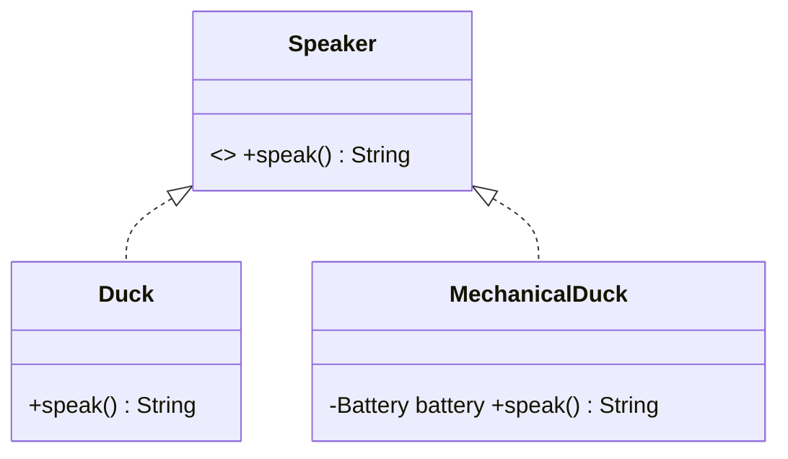

# [[Liskov Substitution Principle (Java)]]

**Context:** [[SOLID Principles (Java)|SOLID]] · the **L** · guarantees [[Polymorphism (Java)|polymorphism]] is safe · if a subtype can't stand in for its base, the **abstraction is wrong**
**Task signature:** a subclass that breaks its parent's contract (throws, does nothing, or needs `instanceof`) — re-model so substitution holds.

> [!abstract] Quick Revision
> - **🎯 Trigger:** substituting a subclass for its base **changes behaviour or breaks** ➔ LSP violated; you extended the wrong class.
> - **⚡ Critical Bottleneck:** formally — if $S$ is a subtype of $T$, any property provable of a $T$ object must hold for an $S$ object; so `T x = new S();` must never surprise the caller.

## 🔧 Minimal Working Example
```java
// SMELL: MechanicalDuck IS-A Duck, but its quack() breaks the contract
class Duck { String quack() { return "Kwek"; } }
class MechanicalDuck extends Duck {
    private Battery battery;
    @Override String quack() {
        if (battery == null) throw new IllegalStateException("no Battery");  // unexpected!
        return "Kwek";
    }
}
// a DuckFarmer expecting every Duck to quack now gets a runtime exception

// FIX: make them SIBLINGS under a Speaker interface, not parent/child
interface Speaker { String speak(); }
class Duck implements Speaker { public String speak() { return "Kwek"; } }
class MechanicalDuck implements Speaker {
    private Battery battery;
    public String speak() { if (battery==null) throw new IllegalStateException(); return "Kwek"; }
}
```
**Expected output:** code using `Speaker` expects "some sound" (contract honoured); code using `Duck` always quacks. No false is-a.

- **Violation indicators** ➔ `instanceof`/`getClass()` inside an override; **empty do-nothing** overrides; an override that **throws** an unexpected exception.
- **Fix** ➔ don't force a false is-a; introduce an interface so the odd class is a **sibling**, or share a common supertype.

## ⚙️ classDiagram (false is-a ➔ siblings)

*(The broken `Duck <|-- MechanicalDuck` generalisation is replaced by **sibling realization** of a `Speaker` interface — no subclass promises a contract it can't honour, so substitution stays safe.)*

## 🔀 Variations — the Circle-Ellipse problem
- **The trap** ➔ mathematically a circle *is-a* ellipse, so `Circle extends Ellipse`; but `Ellipse.stretch()` (change one radius) makes no sense for a `Circle` ➔ `Circle` can't honour `stretch()` ⇒ LSP broken.
- **Resolutions** ➔ (a) don't make `Circle` extend `Ellipse`; (b) both extend a shared `Shape`/`ConicSection`; the right choice **depends on circumstances**.
- **Java hint** ➔ extending a **concrete** class often breaks LSP (and OCP) — a `Creature creature = new FlyingCreature();` that can suddenly fly surprises callers.

## 🥋 Kata (write from blank)
> [!QUESTION]- Kata 1: `Square extends Rectangle` overrides `setWidth` to also set height (to stay square). Why does this break LSP, and what's a fix?
> > [!SUCCESS]- Reference solution
> > - **Why:** code that expects a `Rectangle` can `setWidth(5); setHeight(4)` and assume area 20; a `Square` silently forces 4×4=16 — behaviour changed under substitution.
> > - **Fix:** don't inherit; give both a common `Shape` supertype (or an immutable `area()` interface) so neither promises independent width/height mutation.
> > - **Key move:** the is-a must preserve the **base's behavioural contract**, not just its data shape.

## ⚠️ Pitfalls
- 💡 **`instanceof` in an override = red flag** ➔ branching on the concrete subtype inside a supposedly polymorphic method signals a broken abstraction.
- 💡 **LSP protects [[Polymorphism (Java)|polymorphism]]** ➔ break it and every client of the base (20+ classes) risks a runtime surprise — high coupling to debug.
- 💡 **"is-a" in words ≠ safe inheritance** ➔ test the *behaviour*, not the noun (circle/ellipse, square/rectangle).

> [!NOTE] **LSP via [[Design by Contract (Java)|Design by Contract]] (subcontracting):** a subclass may substitute for its base **iff** its **preconditions are the same or weaker** and its **postconditions are the same or stronger**. A subcontractor (Bob) can replace the original (Alice) only if he demands **no more** of the client and delivers **at least as much** — exactly the DbC restatement of LSP.
