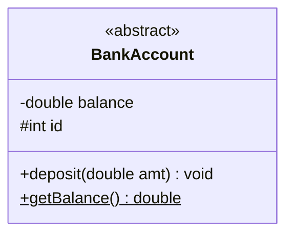
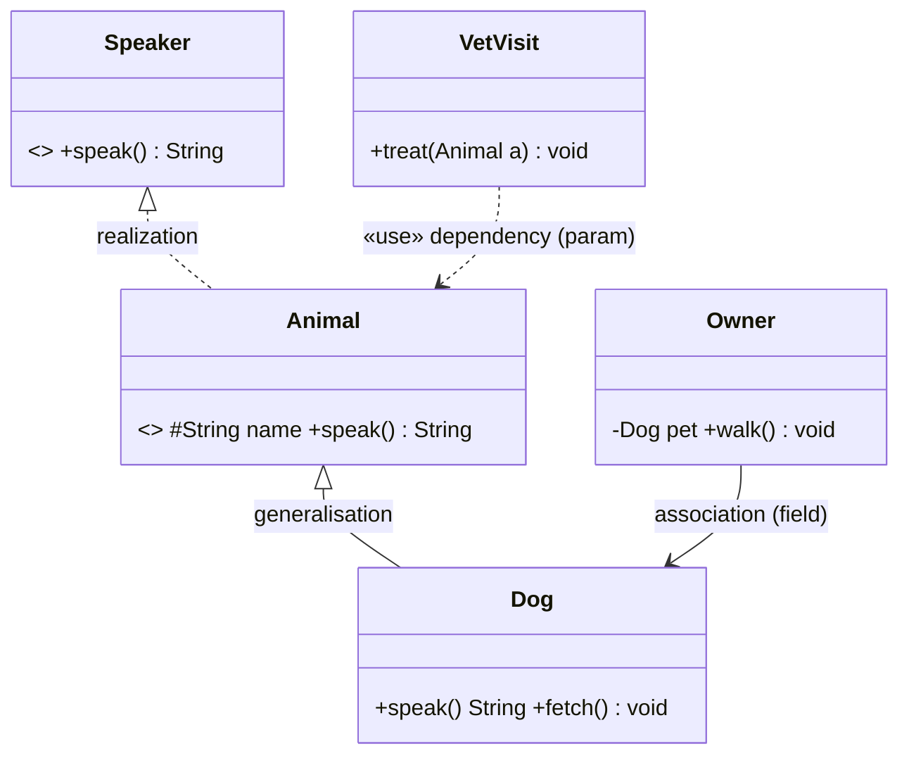
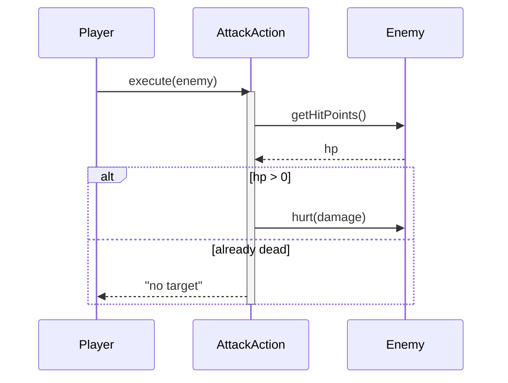

# [[UML Toolkit (Cheatsheet)]]

**Context:** [[FIT2099_MOC]] · the **one-note UML surface** for the assignment — draw a class diagram, a sequence diagram, or a domain/process model from a blank page. Depth in the linked notes.

> [!abstract] Quick Revision
> - **🎯 Objective:** capture a design two ways ➔ **class diagram** = *static* structure (classes + relationships), **sequence diagram** = *dynamic* behaviour (messages over time).
> - **⚡ Critical Bottleneck:** get the **relationship arrow** right on the class diagram (generalisation vs realization vs association vs dependency) and remember diagrams are an **aid to shared understanding**, not the deliverable — see [[Software Design in the Lifecycle (FIT2099)]].

## 📐 Class diagram — box anatomy

- **Three compartments** ➔ **Name** (top, italic/`<<abstract>>` if abstract) · **Attributes** (middle) · **Operations** (bottom).
- **Member line** ➔ `visibility name : Type` for fields, `visibility name(params) : ReturnType` for methods.
- **Static** ➔ underlined (Mermaid: trailing `$`). **Abstract** ➔ italic / `<<abstract>>`.

## 👁️ Visibility & stereotypes
| Symbol | Meaning | Mermaid |
| :--- | :--- | :--- |
| `+` | public | `+m()` |
| `-` | private | `-x` |
| `#` | protected | `#x` |
| `~` | package/default | `~x` |
| `«abstract»` / italics | abstract class or method | `<<abstract>>` |
| `«interface»` | interface | `<<interface>>` |
| `«enumeration»` | enum | `<<enumeration>>` |

*(Full legend: [[UML Class Diagrams (Java)]].)*

## 🔗 Relationship arrows (the assessable core)
| Relationship | Meaning (Java) | UML arrow | Mermaid |
| :--- | :--- | :--- | :--- |
| **Generalisation** | inheritance, `extends` (is-a) | solid line, **hollow triangle** | `Base <|-- Derived` |
| **Realization** | `implements` an interface | dashed line, **hollow triangle** | `Iface <|.. Impl` |
| **Association** | **has-a**, stored as a field | solid line, open arrow | `A --> B` |
| **Dependency** | **uses-a**, method param/local («use») | **dashed** line, open arrow | `A ..> B` |
| **Aggregation** | shared whole-part (hollow ◇) | hollow diamond | `Whole o-- Part` |
| **Composition** | owned whole-part (filled ◆) | filled diamond | `Whole *-- Part` |

> [!NOTE] **Association vs Dependency (top exam trap):** if the other class is a **stored field** ➔ **association** (solid `-->`). If it only appears as a **method parameter / local** ➔ **dependency** (dashed `..>`). See [[UML Associations and Dependencies (Java)]].

- **Multiplicity** ➔ label the ends: `1`, `0..1`, `*` (many), `1..*` (one or more). E.g. `Customer "1" --> "*" Order`.

### Worked class diagram (all four assessable arrows)


## ⏱️ Sequence diagram — dynamic anatomy

| Element | Meaning | Mermaid |
| :--- | :--- | :--- |
| **Lifeline** | an object over time (concrete classes only) | `participant E as Enemy` |
| **Synchronous message** | caller waits | `A->>E: m()` |
| **Return message** | value back | `E-->>A: hp` |
| **Activation bar** | object is executing | `activate`/`deactivate` |
| **Create / delete** | object born/destroyed mid-scenario | message to `create`, `destroy` |
| **`alt`** | branch (if/else) | `alt cond ... else ... end` |
| **`opt`** | optional (if, no else) | `opt cond ... end` |
| **`loop`** | repetition | `loop while cond ... end` |

*(Every `alt`/`opt`/`loop` needs a matching `end`. Depth: [[UML Sequence Diagrams (Java)]].)*

## 🗺️ Modelling & process diagrams (design-process toolkit)
| Tool | Use | Note |
| :--- | :--- | :--- |
| **Conceptual/Domain class diagram** | understand domain concepts + relationships **before** designing | [[Design Process and Techniques (FIT2099)]] |
| **Activity diagram** | model a business **process** / control flow | (Week 11) |
| **Use case** | actor-action / system-response scenario script | ambiguity + tedium are its downsides |
| **CRC card** | Class · Responsibilities · Collaborators (collaborators → associations) | [[CRC Cards (FIT2099)]] |
| **Package diagram** | group classes into namespaces | [[Java Packages and Imports]] |

## 🥋 Integration Kata (≥3 diagram tools — draw from blank)
> [!QUESTION]- Kata: A `Player` runs `AttackAction` on an `Enemy`; `Enemy implements Actor`; the action only strikes if the enemy is alive. Produce (a) a class diagram with realization + association + dependency and (b) a sequence diagram with an `alt`. (uses: class diagram arrows + multiplicity + sequence + fragment)
> > [!SUCCESS]- Reference solution
> > ```mermaid
> > classDiagram
> >     class Actor { <<interface>> +isConscious() boolean +hurt(int d) void }
> >     class Enemy { -int hp +isConscious() boolean +hurt(int d) void }
> >     class Player { -List~Item~ inventory }
> >     class AttackAction { +execute(Actor target) void }
> >     Actor <|.. Enemy : realization
> >     Player --> AttackAction : association
> >     AttackAction ..> Actor : «use» dependency
> > ```
> > ```mermaid
> > sequenceDiagram
> >     participant P as Player
> >     participant A as AttackAction
> >     participant E as Enemy
> >     P->>A: execute(enemy)
> >     activate A
> >     A->>E: isConscious()
> >     E-->>A: true
> >     alt conscious
> >         A->>E: hurt(damage)
> >     else unconscious
> >         A-->>P: "no target"
> >     end
> >     deactivate A
> > ```
> > - **Key move:** `implements` → **dashed hollow-triangle** (`<|..`), stored field → **solid** association (`-->`), method param → **dashed** dependency (`..>`); the runtime "only if alive" check is an **`alt`** fragment on the sequence diagram.

## ⚠️ Pitfalls
- 💡 **Association vs dependency** ➔ field = solid `-->`; parameter-only = dashed `..>`. Mixing them is the most common class-diagram deduction.
- 💡 **Generalisation vs realization** ➔ `extends` = **solid** hollow triangle (`<|--`); `implements` = **dashed** hollow triangle (`<|..`).
- 💡 **Unbalanced fragments** ➔ each `alt`/`opt`/`loop` must close with `end`, or the sequence diagram won't render.
- 💡 **Abstract objects on a sequence diagram** ➔ lifelines are **concrete** runtime objects; don't put an interface/abstract type on a lifeline.
- 💡 **Diagram as the goal** ➔ diagrams **serve** shared understanding; keep them only as detailed as the reader needs.
